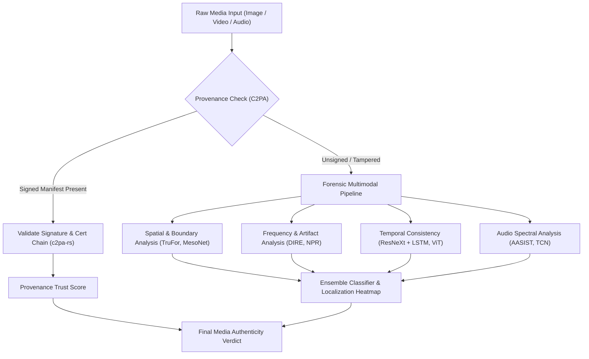

# Awesome Synthetic Media Detection 🔍🛡️

  

  
  
  
  
  
  
  

---

## 🌐 Ecosystem Overview

> **A curated collection of enterprise SaaS products, forensic APIs, open-source AI models, research benchmarks, and C2PA content provenance toolkits for deepfake detection and synthetic media verification.**

**Last updated: August 2026** 📅

This repository tracks the modern ecosystem of **Synthetic Media Detection**, **Generative AI Forensics**, and **Content Provenance (C2PA)**. As generative models for text-to-image (Diffusion, FLUX, Midjourney), audio cloning (VALL-E, ElevenLabs), video synthesis (Sora, Runway Gen-3, Kling), and face-swapping advance, these tools help trust-and-safety teams, enterprises, financial institutions, cybersecurity operations, and journalists assess media authenticity and detect digital tampering.

---

## 📑 Table of Contents

- [📊 Market Landscape & SaaS Platforms](#-market-landscape--saashosted-platforms)
- [💻 Open-Source GitHub Projects](#-open-source-github-projects)
- [🔬 Forensic Architectures & Frameworks](#-forensic-architectures--frameworks)
- [🤝 How to Contribute](#-how-to-contribute)
- [⚠️ Disclaimer](#️-disclaimer)
- [📈 Star History](#-star-history)

---

## 📊 Market Landscape & SaaS/Hosted Platforms

> 💡 **Market Size & Structure Analysis:** The global synthetic media & deepfake detection market is estimated at **$830 Million – $3.8 Billion (2025/2026)** and is projected to reach **$10.6 Billion – $22.6 Billion by 2033/2034**, expanding at a compound annual growth rate (**CAGR of ~22% – 43%**). The sector is currently **moderately fragmented**, comprising specialized multimodal detection startups, embedded identity verification (IDV) platforms, forensic security suites, and big-tech provenance consortia (C2PA), with emerging concentration around enterprise infrastructure and foundation model trust layers.

Below is the comparison of leading commercial SaaS platforms and hosted verification engines, ranked in descending order by **Company Scale (Valuation / Market Capitalization / Revenue)**:

| Platform 🏢 | Valuation / Revenue 💰 | Description 📝 | Pricing 🏷️ | Free Tier / Trial Limits 🎁 |
| :--- | :--- | :--- | :--- | :--- |
| **[Adobe Content Credentials](https://contentauthenticity.org/)** | **~$115B Market Cap** (ADBE) / ~$21.5B ARR | Enterprise provenance and Content Credentials ecosystem to inspect, verify, and attach tamper-evident metadata. | **$0.00 (100% Free)** for Content Authenticity web app (Creative Cloud plans start at $9.99/month) | **Unlimited free access** via Adobe Content Authenticity app & browser inspect tools (requires free Adobe ID) |
| **[Hive](https://thehive.ai/)** | **$2.0B Valuation** (Series D) / ~$164M ARR | Multimodal content moderation and AI-generated media detection APIs across image, video, and audio. | Starting at **$6.00 / 1,000 image requests**, $6.00 / 1,000 video frames, $10.00 / audio hour | **$50 free API credits** on sign-up; default rate limit of 100 requests/day during evaluation + free web demo |
| **[Reality Defender](https://www.realitydefender.com/)** | **~$250M – $500M Est. Valuation** / $33M Series A | Real-time multimodal deepfake detection platform (image, video, audio, text) via API and web app for enterprise security. | Business Plan starting at **$399.00 / month** ($4,788/yr billed annually for 1,000 scans/month) | **Free forever Developer API** with **50 scans/month** (no credit card required) |
| **[Truepic](https://truepic.com/)** | **~$100M – $300M Est. Valuation** / ~$7.3M ARR ($37M Raised) | Content authenticity and C2PA-compliant provenance verification platform (Truepic Vision / Lens). | Starting at **$15.00 – $65.00 per inspection** (tiered volume commitment; custom for >10,000/yr) | **14-day free trial** / guided test inspection demo upon request (no permanent free business tier) |
| **[DeepMedia](https://www.deepmedia.ai/)** | **~$150M Est. Valuation** / $11.7M Funding Raised | Multimodal deepfake detection engine (audio spoofing, video face swap, voice clone) for enterprise & defense. | Starting at **$0.01 per detection request** (enterprise pilot packages start at $1,000.00/month) | **14-day pilot evaluation** with sample detection credits upon sales demo request |
| **[GetReal Security](https://www.getrealsecurity.com/)** | **~$50M – $100M Est. Valuation** / $17.5M Series A | Deepfake detection and media authenticity platform protecting enterprise workflows and identity verification. | Starter kits starting at **$500.00 / month** (use-case pilots); custom quotes for enterprise rollouts | **14-day proof-of-concept / pilot trial** available upon request with guided onboarding demo |
| **[Optic (AI or Not)](https://aiornot.com/)** | **~$40M – $60M Est. Valuation** / ~$19.9M ARR | AI-generated media and deepfake detector for images, audio, and synthetic content analysis. | Starting at **$5.00 / month** (includes $10 monthly API credits, pay-as-you-go thereafter) | **Free forever tier** with **10–20 image checks/month** + **$5 free API credits** on sign-up |
| **[Attestiv](https://attestiv.com/)** | **~$20M – $40M Est. Valuation** / ~$3.5M ARR ($5.2M Raised) | Digital media authenticity, tampering analysis, and forensic verification platform for images, video, and documents. | Starting at **$49.00 / month** for base commercial API licenses | **Free forever plan** with **5 video scans/month**; **30-day full API trial**; unlimited free tier for journalists |
| **[Sensity AI](https://sensity.ai/)** | **~$15M – $30M Est. Valuation** / ~$1.8M ARR ($3.2M Raised) | Visual deepfake and synthetic media detection platform with forensic analysis and threat intelligence. | Starting at **$29.00 / month** (entry-level plan); custom enterprise plans based on scan volume | **7-day free trial** upon sales request for KYC & detection testing; free web demonstration tool |
| **[C2PA Verify](https://c2pa.org/)** | **Open Standard Consortium** (Linux Foundation / Multi-Billion Backers) | Official open-standard provenance inspector for validating and viewing C2PA Content Credentials. | **$0.00 (100% Free)** open-standard public utility | **Unlimited free in-browser and API manifest verification** (no usage cap, no registration required) |

---

## 💻 Open-Source GitHub Projects

Explore prominent open-source deepfake detectors, audio anti-spoofing models, synthetic image forensic toolkits, and C2PA implementations, ranked in descending order by **GitHub Star Count**:

1. **[ondyari/FaceForensics](https://github.com/ondyari/FaceForensics)**  🌟  
   *The gold standard benchmark dataset and forensic baseline networks for facial manipulation, deepfakes, and Face2Face/FaceSwap detection.*

2. **[Daisy-Zhang/Awesome-Deepfakes-Detection](https://github.com/Daisy-Zhang/Awesome-Deepfakes-Detection)**  🌟  
   *Comprehensive curated collection of deepfake detection papers, toolkits, architectures, and state-of-the-art benchmarks.*

3. **[SCLBD/DeepfakeBench](https://github.com/SCLBD/DeepfakeBench)**  🌟  
   *A standardized, extensible deepfake detection benchmark platform integrating 15+ modern detectors, data augmentations, and unified evaluation protocols.*

4. **[abhijithjadhav/Deepfake_detection_using_deep_learning](https://github.com/abhijithjadhav/Deepfake_detection_using_deep_learning)**  🌟  
   *Video deepfake detection pipeline utilizing transfer learning with ResNeXt convolutional neural networks combined with LSTM recurrent sequence modeling.*

5. **[selimsef/dfdc_deepfake_challenge](https://github.com/selimsef/dfdc_deepfake_challenge)**  🌟  
   *Prize-winning solution for the Kaggle Deepfake Detection Challenge (DFDC) featuring ensemble architectures, MTCNN face extraction, and EfficientNet backbones.*

6. **[dessa-oss/DeepFake-Detection](https://github.com/dessa-oss/DeepFake-Detection)**  🌟  
   *Practical deepfake video detection engineering pipeline designed for real-world generalization across diverse video compression artifacts.*

7. **[flyingby/Awesome-Deepfake-Generation-and-Detection](https://github.com/flyingby/Awesome-Deepfake-Generation-and-Detection)**  🌟  
   *Survey repository cataloging the latest advances in generative face synthesis and corresponding forensic countermeasures.*

8. **[laiyingxin2/DADF](https://github.com/laiyingxin2/DADF)**  🌟  
   *Detect Any Deepfakes (DADF) — combining Segment Anything (SAM) with multi-scale face forgery detection, localization, and pixel-level mask segmentation.*

9. **[contentauth/c2pa-rs](https://github.com/contentauth/c2pa-rs)**  🌟  
   *Official Rust SDK for creating, signing, embedding, and validating C2PA (Coalition for Content Provenance and Authenticity) manifests.*

10. **[ZhendongWang6/DIRE](https://github.com/ZhendongWang6/DIRE)**  🌟  
    *Diffusion Reconstruction Error (DIRE) for detecting images generated by diffusion models (DDIM, Stable Diffusion, Midjourney) via error residuals.*

11. **[dessa-oss/fake-voice-detection](https://github.com/dessa-oss/fake-voice-detection)**  🌟  
    *Audio deepfake detection utilizing temporal convolutional networks (TCN) to classify synthetic speech and neural voice clones.*

12. **[HongguLiu/Deepfake-Detection](https://github.com/HongguLiu/Deepfake-Detection)**  🌟  
    *PyTorch implementation of spatial-frequency domain deepfake detectors evaluated on the FaceForensics++ benchmark.*

13. **[YZY-stack/DF40](https://github.com/YZY-stack/DF40)**  🌟  
    *Next-generation comprehensive deepfake detection benchmark covering 40 distinct manipulation techniques and state-of-the-art generative models.*

14. **[media-sec-lab/Audio-Deepfake-Detection](https://github.com/media-sec-lab/Audio-Deepfake-Detection)**  🌟  
    *Aggregated codebase, dataset taxonomy, and benchmark evaluation for speech anti-spoofing and synthesized voice detection.*

15. **[chuangchuangtan/NPR-DeepfakeDetection](https://github.com/chuangchuangtan/NPR-DeepfakeDetection)**  🌟  
    *Neighboring Pixel Relationships (NPR) model for generalizable synthetic image detection across diverse generative adversarial and diffusion generators.*

16. **[DariusAf/MesoNet](https://github.com/DariusAf/MesoNet)**  🌟  
    *Compact, efficient facial video forgery detection neural network analyzing mesoscopic facial features.*

17. **[clovaai/aasist](https://github.com/clovaai/aasist)**  🌟  
    *AASIST: Audio Anti-Spoofing using Integrated Spectro-Temporal Graph Attention Networks for detecting synthetic speech and voice spoofing.*

18. **[yoctta/multiple-attention](https://github.com/yoctta/multiple-attention)**  🌟  
    *Multi-attention deepfake detection exploiting subtle regional inconsistencies and facial blending boundaries.*

19. **[grip-unina/TruFor](https://github.com/grip-unina/TruFor)**  🌟  
    *Forensic image forgery detector extracting learned noise features, anomaly localization heatmaps, and confidence scores.*

20. **[davide-coccomini/Combining-EfficientNet-and-Vision-Transformers-for-Video-Deepfake-Detection](https://github.com/davide-coccomini/Combining-EfficientNet-and-Vision-Transformers-for-Video-Deepfake-Detection)**  🌟  
    *Hybrid architecture combining EfficientNet spatial feature extractors with Vision Transformers (ViT) for video forgery classification.*

21. **[grip-unina/noiseprint](https://github.com/grip-unina/noiseprint)**  🌟  
    *CNN-based camera model fingerprinting tool for blind image manipulation and splicing localization.*

22. **[contentauth/c2patool](https://github.com/contentauth/c2patool)**  🌟  
    *Command-line interface (CLI) for displaying, extracting, generating, and signing C2PA Content Credentials in media files.*

23. **[yuezunli/DSP-FWA](https://github.com/yuezunli/DSP-FWA)**  🌟  
    *Dual Spatial Pyramid for Exposing Face Warp Artifacts in Deepfakes without requiring synthetic training samples.*

24. **[ftralliance/defakepy](https://github.com/ftralliance/defakepy)**  🌟  
    *Modular Python library integrating ensemble forensic techniques and C2PA provenance validators for multimodal synthetic media analysis.*

---

## 🔬 Forensic Architectures & Frameworks

### 🧱 Recommended Custom Stack Architecture
1. **Provenance Verification**: Use the **[C2PA Rust SDK](https://github.com/contentauth/c2pa-rs)** or **[c2patool](https://github.com/contentauth/c2patool)** as the first line of defense to inspect cryptographically signed author credentials and edit history.
2. **Probabilistic Forensic Ensembling**: For unsigned or legacy media, feed content into open forensic detectors (**[DeepfakeBench](https://github.com/SCLBD/DeepfakeBench)**, **[DIRE](https://github.com/ZhendongWang6/DIRE)**, **[TruFor](https://github.com/grip-unina/TruFor)**, **[AASIST](https://github.com/clovaai/aasist)**) to measure diffusion artifacts, blending boundaries, and voice synthesis signatures.
3. **Decision Fusion**: Aggregate metadata signatures, biological cues (blink patterns, pulse rate), and spectral confidence scores into a unified authenticity trust rating for human-in-the-loop review.

---

## 🤝 How to Contribute

Contributions are warmly welcomed! Help make synthetic media detection and content authenticity transparent and accessible:

1. 🍴 **Fork the repository**.
2. 🌿 **Create a feature branch**: `git checkout -b add-new-detector`
3. 📝 **Add or update entries** following the tabular or bulleted format with accurate links, descriptions, and badges.
4. 🚀 **Submit a Pull Request** with a concise summary of the addition.

---

## ⚠️ Disclaimer

- This is a **community-curated** list for educational, research, and security verification purposes — not an individual endorsement.
- Synthetic media detection is inherently probabilistic. Detectors can produce false positives and false negatives against novel generative models. Always combine automated signals with human forensic review in critical applications.

---

## 📈 Star History

---

  <b>Built for Trust & Safety teams, AI researchers, cybersecurity professionals, and journalists defending media integrity. 🛡️✨</b>

